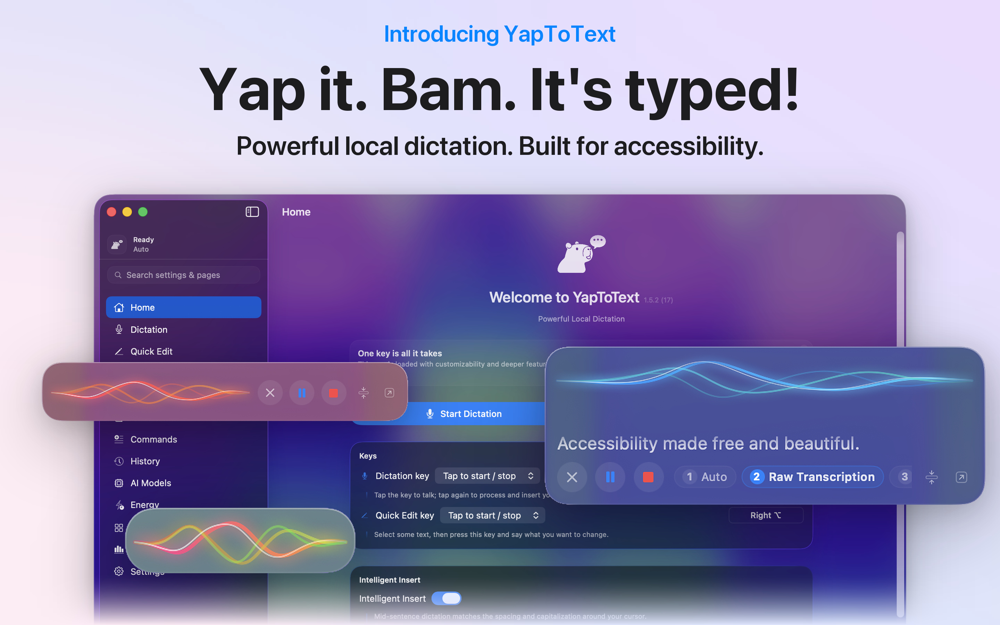
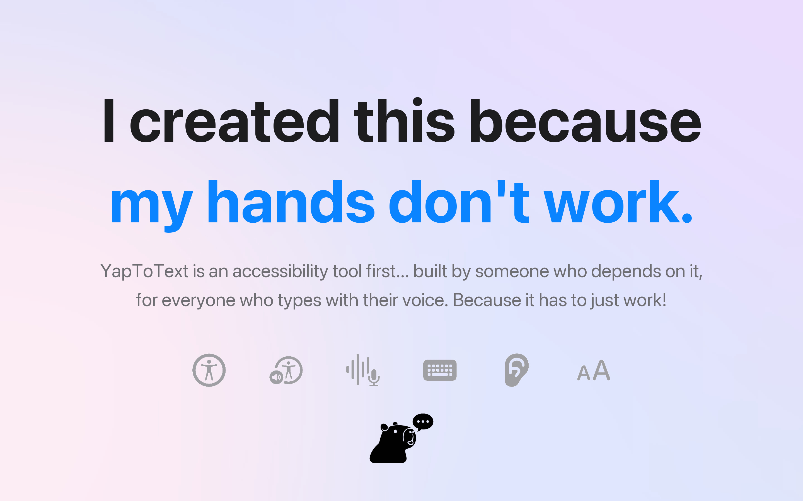
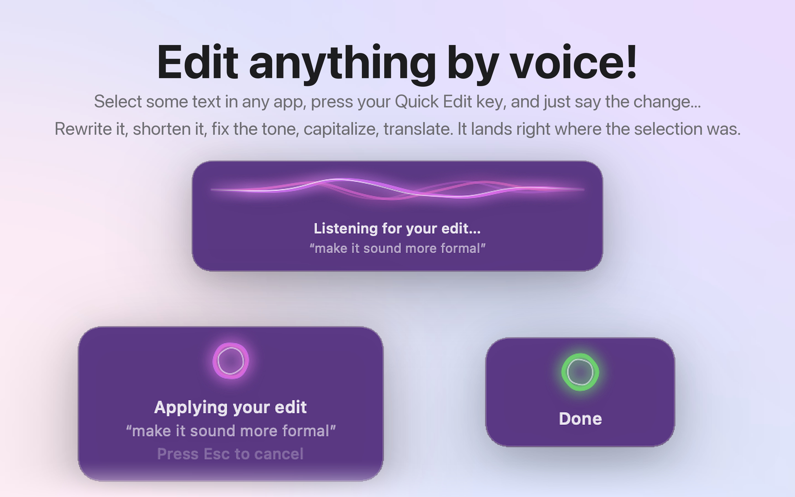
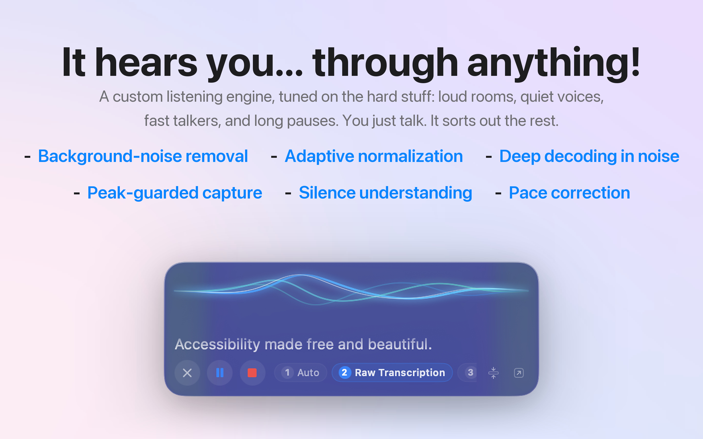
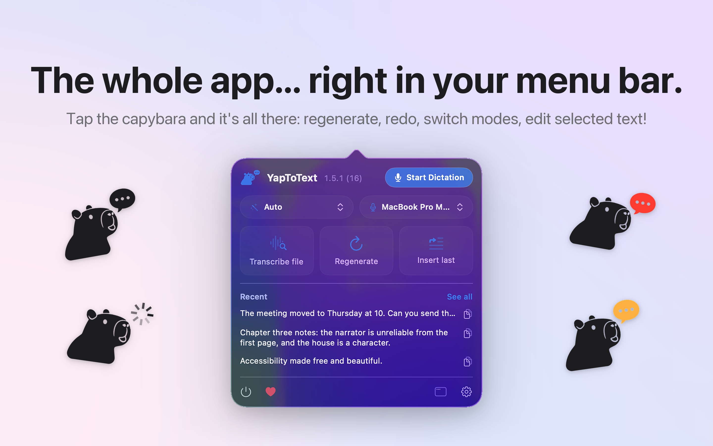
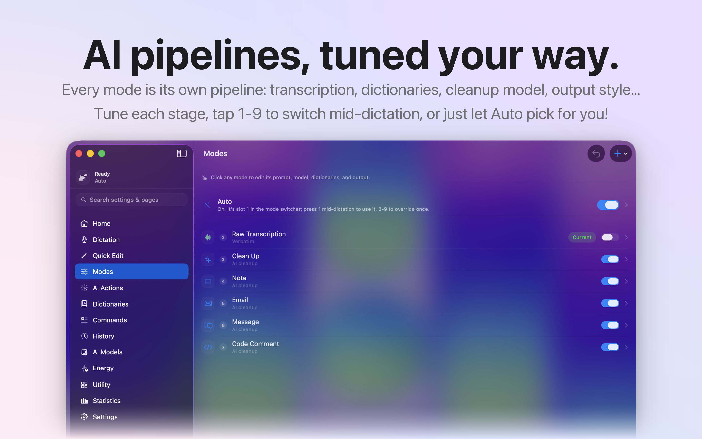
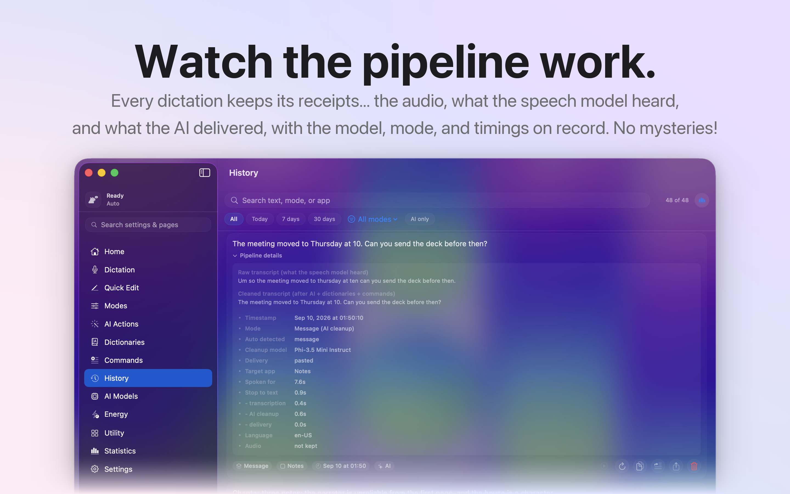
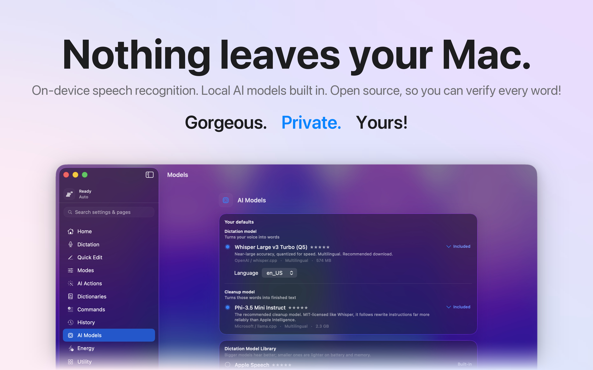
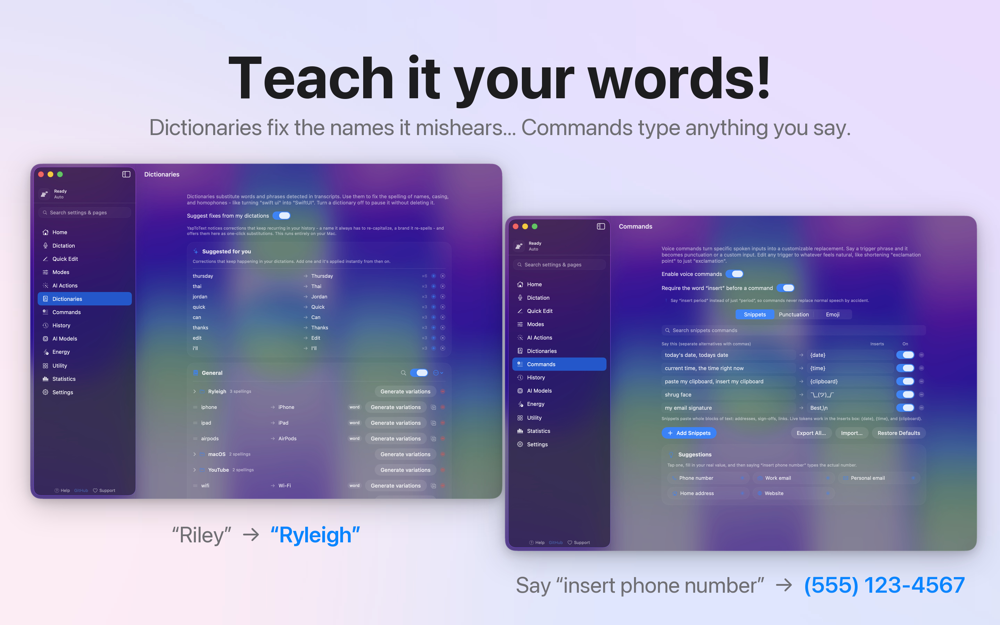
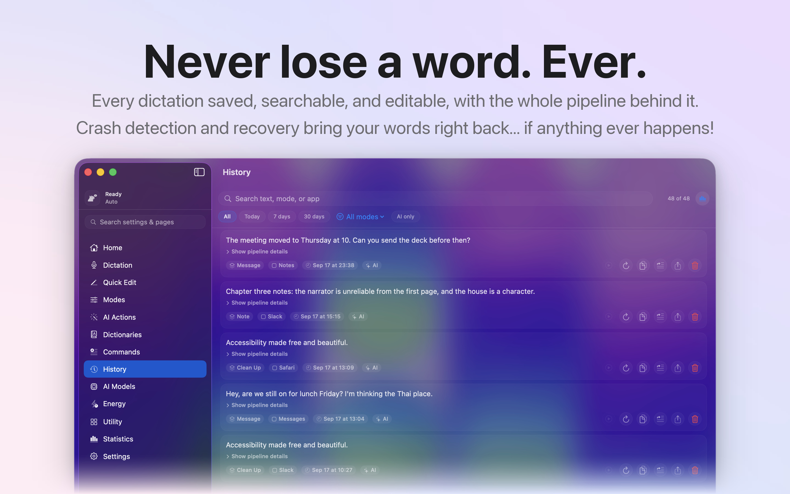

# YapToText

**Yap it. Bam. It's typed.**

YapToText is a free, open-source dictation app for macOS that runs entirely on your Mac.
Press one key, talk, and your words land wherever your cursor is, cleaned up and
punctuated. Nothing ever leaves your machine: no account, no cloud, no subscription.

It is the no-subscription alternative to Wispr Flow, superwhisper, and MacWhisper, built
by someone who cannot type and dictates everything, including this.

[](https://apps.apple.com/us/app/yaptotext/id6786382289?mt=12)

Website: [yaptotext.com](https://yaptotext.com) (help, install, release notes)

## Overview

Tap Right Command anywhere on your Mac, say what you want to write, and tap again. The
speech model (Whisper Large v3 Turbo) and the cleanup model (Phi-3.5 Mini) both ship
inside the app, so it works offline from the first launch. Auto mode reads each dictation
and shapes it for where it is going, Quick Edit rewrites any selected text by voice, and
everything else in the sidebar is optional.

## What's new in 1.5.2

- Bluetooth hearing aids and headsets keep their full sound quality: the app uses the microphone you chose instead of switching to the Bluetooth one, and Music comes back at full quality after every dictation
- Fixed a crash and a freeze when a Bluetooth device connected mid-dictation
- Intelligent Insert is more reliable in Gmail, chat pages, and Electron apps, and dictating over a selection now replaces it the way it was written
- Quick Edit swaps a word or phrase exactly as you say it, instantly
- Cleanup no longer drops words you said
- Hallucinated speaker labels like "Name:" and stage directions are gone
- Miscellaneous bug fixes

Full release history in [CHANGELOG.md](CHANGELOG.md). This section tracks the latest release.

## A tour



Open YapToText and the whole app is on one screen: your dictation and Quick Edit keys,
Intelligent Insert, the after-transcription switches, and your stats. The floating panel
shows your voice as a live wave while you talk, in whichever size and colour you like.



YapToText is an accessibility tool first. One key runs everything, that key can be any
key, and dictation can fully replace typing. It works alongside VoiceOver and Voice
Control, and it was built by someone who depends on it every day.



Select some text in any app, tap your Quick Edit key, and say the change: shorten it,
fix the tone, capitalize it, translate it. The result lands right where the selection
was. Small, exact requests like "change this to hearing aids" are instant and skip the AI.



Background noise is removed before transcription, quiet voices are lifted to full
clarity by measuring your voice against the room, and the decoder digs deeper when the
room gets loud. Whispering next to a running 3D printer transcribes cleanly.



Click the capybara to start a dictation, switch mode or microphone, transcribe a file,
regenerate your last dictation as any mode, or insert it again. His speech bubble turns
red while recording, spins while transcribing, and flashes green when your text lands.



Every mode is its own pipeline: transcription, dictionaries, cleanup model, output style.
Raw Transcription, Clean Up, Note, Email, Message, and Code are built in, every one is
editable in plain language, and you can press 1 to 9 mid-dictation to switch, or let
Auto pick for you.



Every dictation keeps its receipts: the audio, what the speech model heard, what the AI
delivered, and the model, mode, and timings behind it. Nothing is a mystery.



On-device speech recognition, local AI models built in, no analytics, no tracking, no
accounts. The code is open source under GPL-3.0, so every one of those claims can be
checked instead of trusted.



Dictionaries fix the names it mishears, and fixing the same word twice makes the app
offer to remember it. Commands type anything you say: "insert phone number" types your
real number, "insert smiley face" types the emoji.



Every dictation is saved on your Mac with playback, search, editing, and export. If the
app or the Mac dies mid-sentence, the audio survives and is transcribed on the next
launch, so the words are waiting for you in History.

## How it compares

| | YapToText | Wispr Flow | superwhisper | MacWhisper | Apple Dictation |
|---|---|---|---|---|---|
| Cost | Free, forever | Subscription | Free tier, paid tiers | Paid, one time | Free |
| Where your voice goes | Never leaves your Mac | Cloud | Local or cloud | Local | Local |
| Open source | Yes, GPL-3.0 | No | No | No | No |
| Works offline | Yes, from first launch | No | Yes | Yes | Yes |
| AI cleanup of what you said | Yes, on device | Yes | Yes | Yes | No |
| Edit selected text by voice | Yes | No | No | No | No |
| Account required | No | Yes | No | No | No |
| Built for accessibility | Yes, VoiceOver and Voice Control | Not stated | Not stated | Not stated | Yes |

Checked August 2026. The paid apps are good software and some of them do things I don't
do yet. Prices and features change, so check for yourself before you switch.

## Everything it does

- **Dictate anywhere.** One tap of Right Command starts dictation in any app, and the
  text is typed right at the cursor. Tap to toggle or hold to talk, pause with Space,
  cancel with Esc, and remap the key to anything.
- **Intelligent Insert.** Dictate into the middle of a sentence and the case, spacing,
  and punctuation adapt to the text around your cursor. Dictate over a selection and the
  replacement takes its shape. Turn it off per app if an app dislikes it.
- **Quick Edit.** Select text in any app, tap your Quick Edit key, and say the change.
  Rewrite, shorten, fix tone, translate, or swap a word exactly as you say it.
- **Auto mode.** It reads each dictation and picks the right format on its own: an email
  comes out as an email, a quick message stays casual, everything else is cleaned up.
  End with "make that formal" or "as a bullet list" and it follows the instruction.
- **Modes for everything.** Raw Transcription, Clean Up, Email, Note, Message, Code, or
  write your own with custom instructions and give each app its own default. Press 1
  through 9 mid-dictation to switch.
- **Send it for me.** Choose a key per app (Return or Command Return) that is pressed the
  moment your words land, so a dictated message goes out on its own.
- **Hears you through anything.** Background-noise removal, adaptive amplification that
  measures your voice against the room, and deeper decoding when it gets loud. Bluetooth
  hearing aids and headsets keep their full sound quality.
- **Fully on device.** The speech model and the cleanup model ship inside the app. It
  works offline from the first launch. Bring your own Whisper or GGUF model if you like,
  and let the models follow your power source on the Energy page.
- **Teach it your words.** Dictionaries fix the names it mishears. Commands type anything
  you say. Say "add this to my dictionary" over a selection and it is learned.
- **Never lose a word.** Crash recovery rescues interrupted dictations. Full history with
  playback, search, editing, export, and statistics, all computed locally.
- **Transcribe any file.** Drop in audio or video, get the text.
- **Built for accessibility.** Works with VoiceOver and Voice Control, one key runs
  everything, and dictation can fully replace typing.

## Requirements

- macOS 14 (Sonoma) or later, Apple Silicon. On macOS 26 the interface picks up the new Liquid Glass look.
- Xcode 26+ to build from source.
- AI modes use Apple Intelligence when it's on, or the bundled local model when it isn't.
  Raw transcription needs neither.

## Permissions

- **Microphone (required):** so it can hear you.
- **Accessibility (required for automatic pasting):** macOS only lets apps with this
  permission type into other apps. Without it, YapToText still transcribes everything and
  copies the result to your clipboard.

## Privacy

The formal policy is in [PRIVACY.md](PRIVACY.md); the short version:

- Audio is processed on device and is never uploaded.
- History stores your transcripts as JSON in the app's own container on your Mac, and (by
  default) the audio of each dictation next to them so you can play a recording back. The
  audio stays on your Mac like everything else; turn off "save audio with history" in
  Settings to keep text only, choose how much history is retained, or delete any entry -
  its audio is removed with it.
- No network calls. No analytics, no account, no tracking of any kind.
- The entire source is here, so none of this has to be taken on faith.

### The boring details

The bullet points above are the promise; this is exactly where every byte lives and travels.

- **Audio.** Captured from the microphone, transcribed in memory on your Mac. While a
  dictation is running, the audio is also written to a file inside the app's sandboxed
  container as a crash-recovery net. With "save audio with history" on (the default) that
  file is kept alongside the History entry for playback; with it off, the file is deleted
  the moment the dictation ends. Deleting a History entry deletes its audio, and the
  history retention setting prunes old audio automatically. Nothing is ever sent anywhere.
- **Raw transcript.** What the speech model heard, before any cleanup. Kept in History
  (alongside the cleaned text) so you can always compare the two - each entry has a
  "Show what was heard" toggle. History is a plain JSON file in the app's container:
  `~/Library/Containers/.../Data/Library/Application Support/YapToText/history.json`.
- **Cleaned text.** Produced on device, either by Apple's on-device models or by the bundled
  local models. The prompt and your text never leave the machine.
- **Model downloads.** The ONLY network traffic the app can generate, and only when you
  explicitly click a download button: models are fetched over HTTPS from Hugging Face and
  stored in the app's container. No request carries anything about you or your dictations.
  The recommended models can also ship inside the app bundle, in which case even this
  traffic never happens.
- **Crash logs.** Standard Apple crash reporting only, governed by your macOS analytics
  settings. The app has no crash SDK of its own and phones home to nothing.
- **Update checks.** None. Updates come from the Mac App Store (or you rebuild from
  source); the app itself never checks a server.
- **Settings, dictionaries, modes.** JSON files in the same sandboxed container. Deleting
  the app deletes all of it.

## Building

```bash
git clone https://github.com/ryleighnewman/YapToText.git
open YapToText/YapToText.xcodeproj
```

Select the YapToText scheme and press Cmd-R. The app is sandboxed and builds the same way
it ships.

## Questions people ask

**Is there a free alternative to Wispr Flow?**
This is one. YapToText does the same job, costs nothing, and runs on your Mac instead of a
server, so there is no subscription and no account.

**Is there an open-source superwhisper alternative?**
Yes. The whole app is here under GPL-3.0, including the speech and AI pipeline, so you can
read exactly what happens to your voice.

**What is the best free dictation app for Mac?**
I am biased, so here is the honest version: Apple's built-in dictation is free and fine for
short bursts. If you want AI cleanup, modes, custom vocabulary, and editing text by voice
without paying monthly, that is what I built this for.

**How is this different from Apple's built-in dictation?**
Apple's transcribes what you say. This transcribes it, then formats it: an email comes out
as an email, a note as a note. It also fixes words it mishears, remembers your history, and
lets you edit any selected text by speaking.

**Does it work offline?**
Yes, from the first launch. The speech model and the AI cleanup model are inside the app.

**Does my voice get sent anywhere?**
No. There are no network calls at all unless you click a button to download an optional
model. The Privacy section below documents every byte.

**Is it really free? What is the catch?**
No catch. No paid tier, no locked features, no ads, no data collection. There is a tip jar
in the app if you want to, and that is it. I built it because I need it, and charging
disabled people for the ability to type felt wrong.

**Which Macs does it run on?**
macOS 14 (Sonoma) or later on Apple Silicon.

## Support

YapToText is free with no locked features. If it helps you, there's a tip jar in the app,
and that's it. Bug reports and ideas are welcome in
[Issues](https://github.com/ryleighnewman/YapToText/issues).
