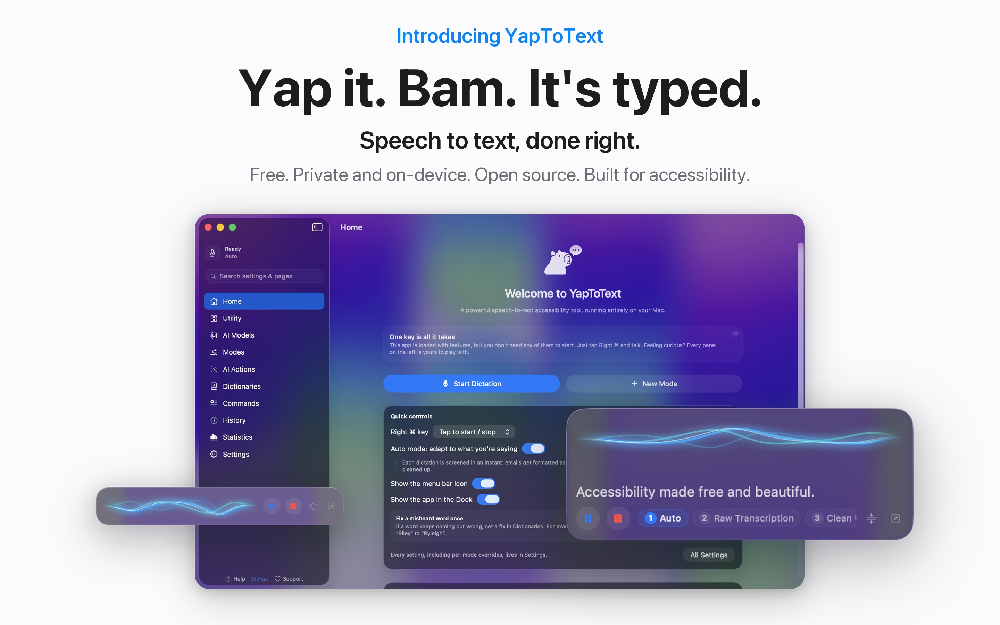
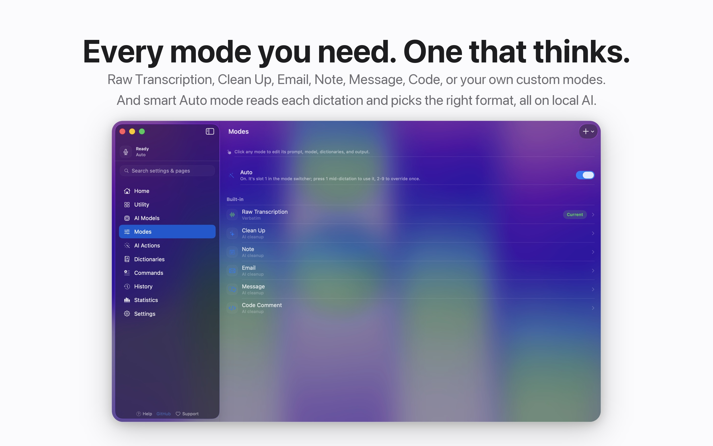
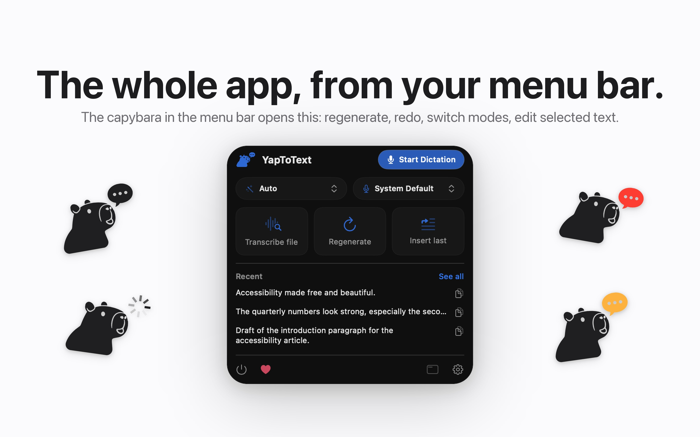
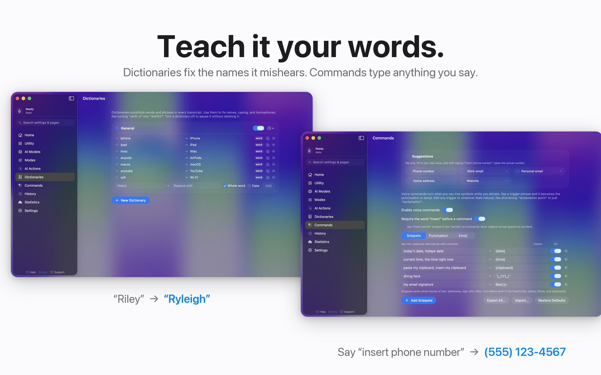
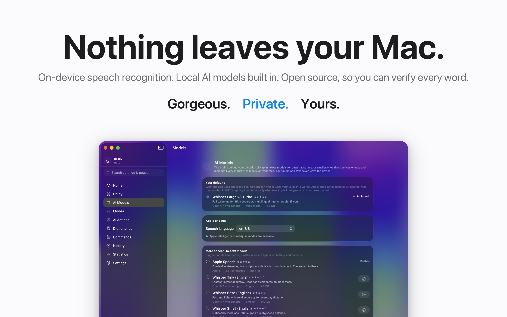

# YapToText

**Yap it. Bam. It's typed.**

Free, private speech to text for your whole Mac. Press one key, talk, and your words land
wherever your cursor is. Everything runs on your Mac, and nothing ever leaves it.

[](https://apps.apple.com/us/app/yaptotext/id6786382289?mt=12)



## Why it exists

I built YapToText because I need it. My hands make typing difficult, so I dictate
everything. The good dictation apps all wanted a subscription and sent my voice to their
servers. I didn't want either, so I made my own, and I'm giving it away.

## What it does

- **Dictate anywhere.** One tap of Right Command starts dictation in any app. Your text is
  typed right at the cursor.
- **Fully on device.** The speech model and the AI cleanup model ship inside the app. It
  works offline from the first launch. No account, no cloud, no analytics.
- **Auto mode.** It reads each dictation and picks the right format on its own. An email
  comes out as an email, a quick message stays casual, everything else just gets cleaned up.
- **Modes for everything.** Raw Transcription, Clean Up, Email, Note, Message, Code, or
  write your own with custom instructions. Press 1 through 9 mid-dictation to switch.
- **Teach it your words.** Dictionaries fix the names it mishears. Commands type anything
  you say: "insert phone number" types your real number.
- **Never lose a word.** Crash recovery rescues interrupted dictations. Full history with
  playback, search, editing, and export.
- **Transcribe any file.** Drop in audio or video, get the text.
- **Built for accessibility.** Works with VoiceOver and Voice Control, one key runs
  everything, and dictation can fully replace typing.









## Requirements

- macOS 26 (Tahoe) or later, Apple Silicon.
- Xcode 26+ to build from source.
- AI modes use Apple Intelligence when it's on, or the bundled local model when it isn't.
  Raw transcription needs neither.

## Permissions

- **Microphone (required):** so it can hear you.
- **Accessibility (required for automatic pasting):** macOS only lets apps with this
  permission type into other apps. Without it, YapToText still transcribes everything and
  copies the result to your clipboard.

## Privacy

- Audio is processed on device and is never uploaded.
- History stores text only, as JSON in the app's own container on your Mac.
- No network calls. No analytics, no account, no tracking of any kind.
- The entire source is here, so none of this has to be taken on faith.

## Building

```bash
git clone https://github.com/ryleighnewman/YapToText.git
open YapToText/YapToText.xcodeproj
```

Select the YapToText scheme and press Cmd-R. The app is sandboxed and builds the same way
it ships.

## Support

YapToText is free with no locked features. If it helps you, there's a tip jar in the app,
and that's it. Bug reports and ideas are welcome in
[Issues](https://github.com/ryleighnewman/YapToText/issues).
