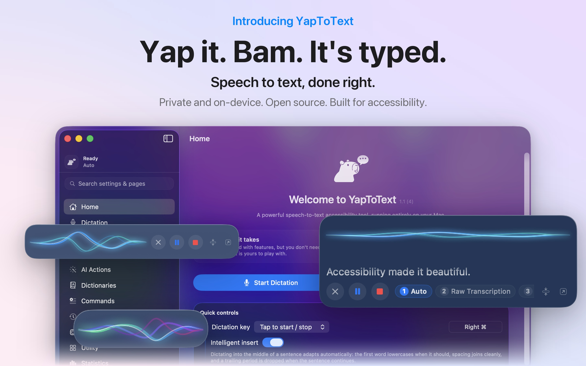
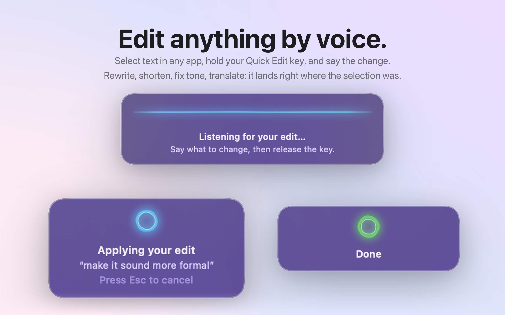
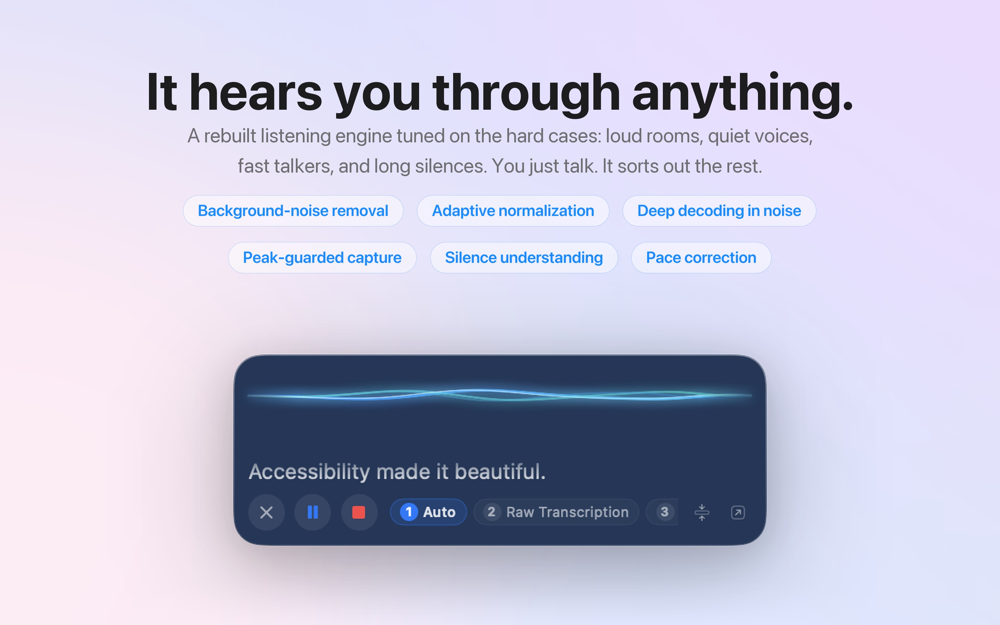
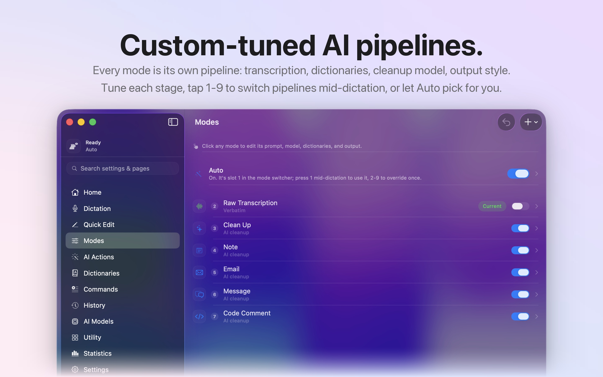
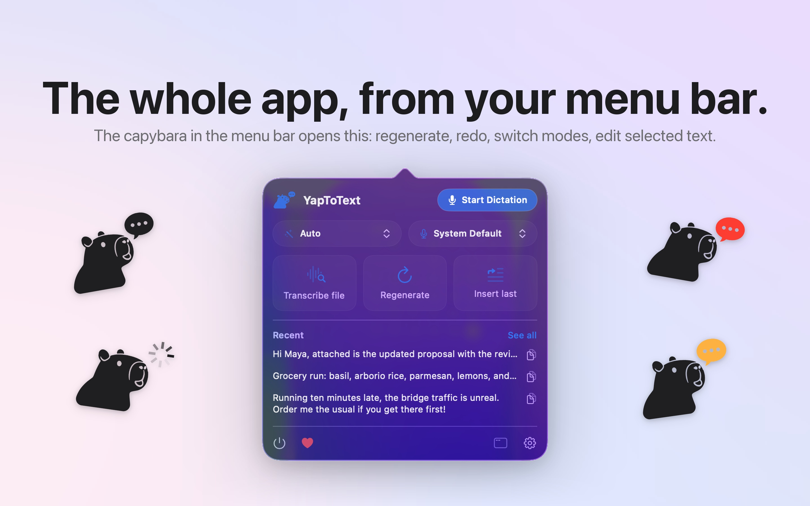
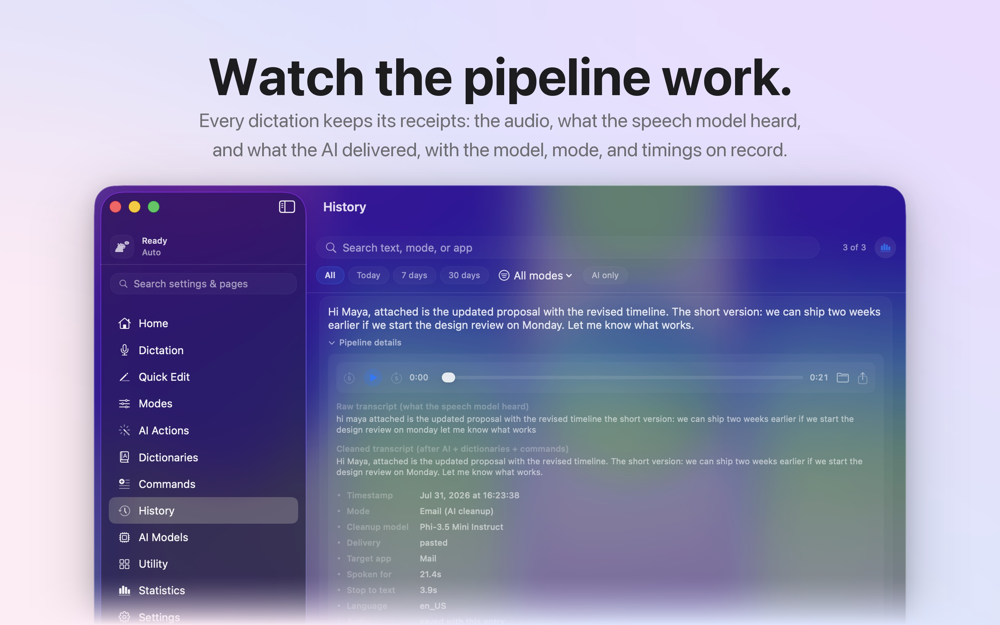
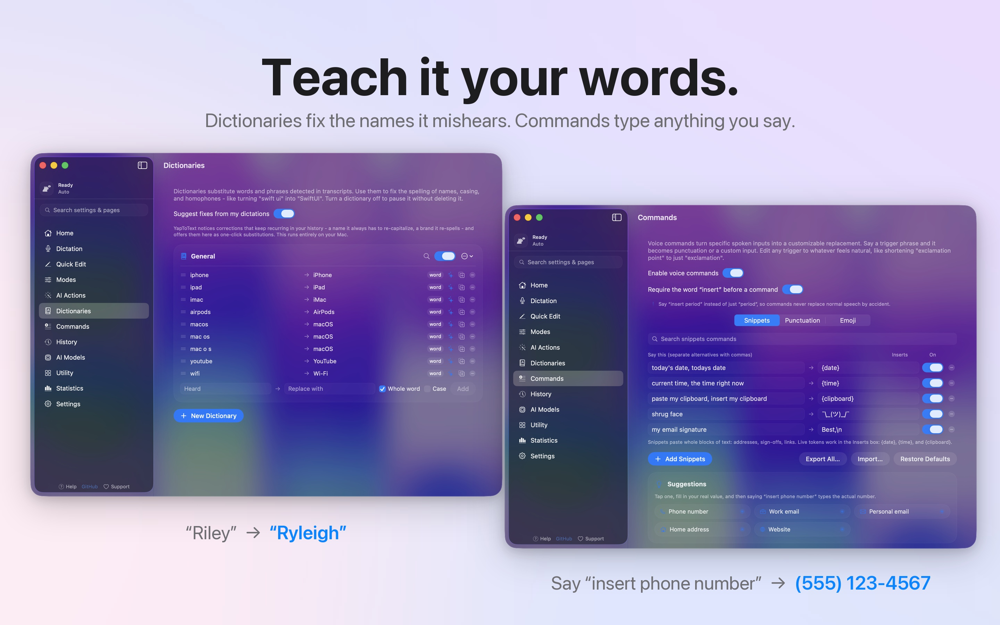
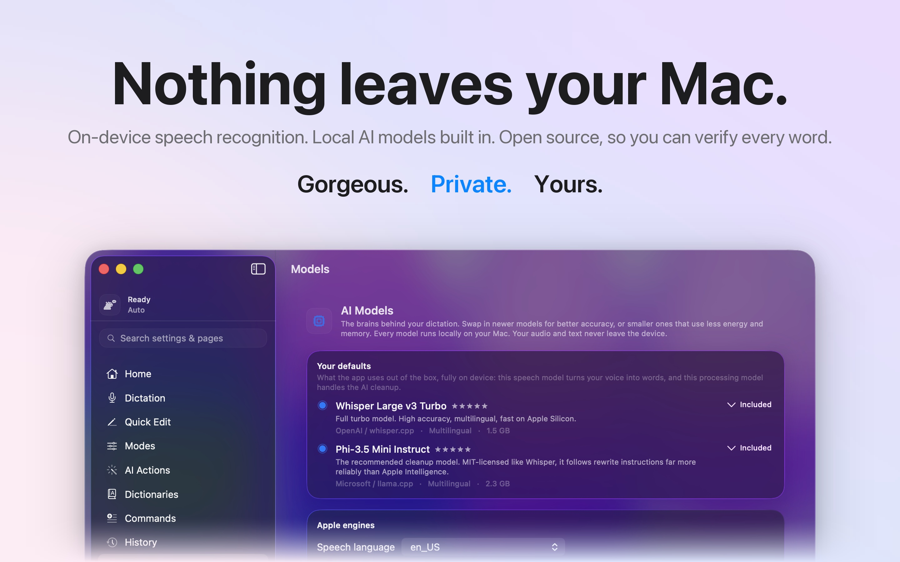

# YapToText

**Yap it. Bam. It's typed.**

YapToText is a free, open-source dictation app for macOS that runs entirely on your Mac.
It is a no-subscription alternative to Wispr Flow, superwhisper, and MacWhisper: Whisper
speech to text plus local AI cleanup, with no account and no cloud.

Press one key, talk, and your words land wherever your cursor is. Nothing ever leaves your
machine.

[](https://apps.apple.com/us/app/yaptotext/id6786382289?mt=12)



## Why it exists

I built YapToText because I need it. My hands make typing difficult, so I dictate
everything. The good dictation apps all wanted a subscription and sent my voice to their
servers. I didn't want either, so I made my own, and I'm giving it away.

## How it compares

| | YapToText | Wispr Flow | superwhisper | MacWhisper | Apple Dictation |
|---|---|---|---|---|---|
| Cost | Free, forever | Subscription | Free tier, paid tiers | Paid, one time | Free |
| Where your voice goes | Never leaves your Mac | Cloud | Local or cloud | Local | Local |
| Open source | Yes, GPL-3.0 | No | No | No | No |
| Works offline | Yes, from first launch | No | Yes | Yes | Yes |
| AI cleanup of what you said | Yes, on device | Yes | Yes | Yes | No |
| Edit selected text by voice | Yes | No | No | No | No |
| Account required | No | Yes | No | No | No |
| Built for accessibility | Yes, VoiceOver and Voice Control | Not stated | Not stated | Not stated | Yes |

Checked August 2026. The paid apps are good software and some of them do things I don't
do yet. Prices and features change, so check for yourself before you switch.

## What it does

- **Dictate anywhere.** One tap of Right Command starts dictation in any app. Your text is
  typed right at the cursor.
- **Quick Edit (new in 1.1).** Select text in any app, press your Quick Edit key, and say
  the change. Rewrite, shorten, fix tone, translate: it lands right where the selection was.
- **Hears you through anything (new in 1.1).** A rebuilt listening engine: background-noise
  removal, adaptive normalization, and deeper decoding when the room gets loud. Whispering
  next to a running 3D printer transcribes cleanly.
- **Fully on device.** The speech model and the AI cleanup model ship inside the app. It
  works offline from the first launch. No account, no cloud, no analytics.
- **Auto mode.** It reads each dictation and picks the right format on its own. An email
  comes out as an email, a quick message stays casual, everything else just gets cleaned up.
- **Modes for everything.** Raw Transcription, Clean Up, Email, Note, Message, Code, or
  write your own with custom instructions. Press 1 through 9 mid-dictation to switch.
- **Teach it your words.** Dictionaries fix the names it mishears. Commands type anything
  you say: "insert phone number" types your real number.
- **Never lose a word.** Crash recovery rescues interrupted dictations. Full history with
  playback, search, editing, and export.
- **Transcribe any file.** Drop in audio or video, get the text.
- **Built for accessibility.** Works with VoiceOver and Voice Control, one key runs
  everything, and dictation can fully replace typing.















## What's new in 1.4

- Spoken punctuation follows the standard dictation convention: say “is it working now, question mark” and get “is it working now?” with no stray mark left behind
- Punctuation names spoken in the middle of a sentence stay as words; they become the mark only at the end of a clause
- Quiet speech: auto-amplify now measures your voice against the room instead of a fixed level, and the app warns when the Mac’s input volume is low and can raise it for you
- Cleanup can no longer drop a sentence or add an ellipsis you did not say
- A long dictation that ends in silence no longer repeats its last sentence over and over, and long dictations clean up faster
- Fixed a crash when changing the input device; the microphone meter in Settings now follows the chosen input
- Fixed hallucinated speaker labels such as “Male speaker:” appearing in transcripts and being learned as vocabulary
- Intelligent insert reads around the cursor more reliably in web and Electron apps, with fewer keystrokes and fewer system beeps
- A notice under Intelligent insert explains the beep and how to silence it in Sound settings
- The menu bar spinner is visible on a light menu bar
- Light mode has a firmer window background and clearer card edges
- The first dictation after idle is faster, and the microphone lets go properly after every dictation
- Restore Defaults in Settings > Advanced puts every setting back, with a confirmation and an Undo button
- The Homebrew build can use the microphone

## What's new in 1.3.1

- Dictation is over twice as fast, with a new default speech model
- The app is about a gigabyte smaller
- Intelligent insert is faster and now works in far more apps
- Your clipboard is handed back right after a dictation is pasted
- Auto mode no longer turns what you say into a list on its own
- Energy settings now switch the cleanup model with the power source, not just the dictation model
- The AI Models page shows what each model is for, with accuracy and speed ratings
- A rewritten in-app Help covering Quick Edit, intelligent insert, and energy
- Bug fixes, including the menu bar spinner running backwards

1.3 shipped this same work but bundled the wrong speech model, so the speed and size
gains only actually arrive in 1.3.1.

## What's new in 1.2

- Dramatically faster from stop to text: models warm at launch, the AI cleanup reuses its work between dictations, and needless extra passes were trimmed
- New master switch: turn off post-transcription analysis for the fastest possible raw transcription
- Your dictionary now shapes what the app hears, not just what it types; fix the same misheard word twice and it offers to remember it for good
- Energy-aware transcription: the full model plugged in, a lighter one on battery, automatically or per mode, with an Energy page that reads your Mac and recommends the right models
- A diagnostic history: raw transcript, cleaned text, delivered text, delivery outcome, processing time, and optional audio playback for every dictation
- A microphone health check in Settings with specific tips
- Long recordings stream out as you go, cut at natural pauses
- Better accuracy in noisy rooms and for fast speech; words finished right at the stop key are no longer clipped
- Ending a dictation never starts audio that was not already playing; a paused player is only resumed if the app paused it
- Fixed a rare crash when the audio device changed mid-dictation, and a freeze at dictation start while checking Music

## What's new in 1.1.1

- The microphone releases as soon as a dictation ends; the recording indicator only shows while you dictate
- The Quick Edit key is consistent: press on / press off in toggle mode, press on / release off in hold mode
- The recording pop-up opens the same way every time, and inserting text no longer stalls its closing animation
- Intelligent insert reads the surrounding text more reliably

## What's new in 1.1

- Quick Edit: edit any selected text by voice, in any app
- Rebuilt listening engine: noise removal, adaptive normalization, deep decoding in noise
- Voice corrections: "scratch that", "replace X with Y", "add this to my dictionary"
- Any key can be a trigger, not just modifiers
- Intelligent insert adapts mid-sentence dictation to the surrounding text
- Re-choreographed recording pop-up; the wave condenses into a spinning ring
- Faster AI cleanup (GPU context reused), lower idle CPU
- Custom colors with a full RGB mode; bring your own Whisper or GGUF models
- Dozens of fixes; the full changelog lives in the app under About

## Requirements

- macOS 14 (Sonoma) or later, Apple Silicon. On macOS 26 the interface picks up the new Liquid Glass look.
- Xcode 26+ to build from source.
- AI modes use Apple Intelligence when it's on, or the bundled local model when it isn't.
  Raw transcription needs neither.

## Permissions

- **Microphone (required):** so it can hear you.
- **Accessibility (required for automatic pasting):** macOS only lets apps with this
  permission type into other apps. Without it, YapToText still transcribes everything and
  copies the result to your clipboard.

## Privacy

The formal policy is in [PRIVACY.md](PRIVACY.md); the short version:

- Audio is processed on device and is never uploaded.
- History stores your transcripts as JSON in the app's own container on your Mac, and (by
  default) the audio of each dictation next to them so you can play a recording back. The
  audio stays on your Mac like everything else; turn off "save audio with history" in
  Settings to keep text only, choose how much history is retained, or delete any entry -
  its audio is removed with it.
- No network calls. No analytics, no account, no tracking of any kind.
- The entire source is here, so none of this has to be taken on faith.

### The boring details

The bullet points above are the promise; this is exactly where every byte lives and travels.

- **Audio.** Captured from the microphone, transcribed in memory on your Mac. While a
  dictation is running, the audio is also written to a file inside the app's sandboxed
  container as a crash-recovery net. With "save audio with history" on (the default) that
  file is kept alongside the History entry for playback; with it off, the file is deleted
  the moment the dictation ends. Deleting a History entry deletes its audio, and the
  history retention setting prunes old audio automatically. Nothing is ever sent anywhere.
- **Raw transcript.** What the speech model heard, before any cleanup. Kept in History
  (alongside the cleaned text) so you can always compare the two - each entry has a
  "Show what was heard" toggle. History is a plain JSON file in the app's container:
  `~/Library/Containers/.../Data/Library/Application Support/YapToText/history.json`.
- **Cleaned text.** Produced on device, either by Apple's on-device models or by the bundled
  local models. The prompt and your text never leave the machine.
- **Model downloads.** The ONLY network traffic the app can generate, and only when you
  explicitly click a download button: models are fetched over HTTPS from Hugging Face and
  stored in the app's container. No request carries anything about you or your dictations.
  The recommended models can also ship inside the app bundle, in which case even this
  traffic never happens.
- **Crash logs.** Standard Apple crash reporting only, governed by your macOS analytics
  settings. The app has no crash SDK of its own and phones home to nothing.
- **Update checks.** None. Updates come from the Mac App Store (or you rebuild from
  source); the app itself never checks a server.
- **Settings, dictionaries, modes.** JSON files in the same sandboxed container. Deleting
  the app deletes all of it.

## Building

```bash
git clone https://github.com/ryleighnewman/YapToText.git
open YapToText/YapToText.xcodeproj
```

Select the YapToText scheme and press Cmd-R. The app is sandboxed and builds the same way
it ships.

## Questions people ask

**Is there a free alternative to Wispr Flow?**
This is one. YapToText does the same job, costs nothing, and runs on your Mac instead of a
server, so there is no subscription and no account.

**Is there an open-source superwhisper alternative?**
Yes. The whole app is here under GPL-3.0, including the speech and AI pipeline, so you can
read exactly what happens to your voice.

**What is the best free dictation app for Mac?**
I am biased, so here is the honest version: Apple's built-in dictation is free and fine for
short bursts. If you want AI cleanup, modes, custom vocabulary, and editing text by voice
without paying monthly, that is what I built this for.

**How is this different from Apple's built-in dictation?**
Apple's transcribes what you say. This transcribes it, then formats it: an email comes out
as an email, a note as a note. It also fixes words it mishears, remembers your history, and
lets you edit any selected text by speaking.

**Does it work offline?**
Yes, from the first launch. The speech model and the AI cleanup model are inside the app.

**Does my voice get sent anywhere?**
No. There are no network calls at all unless you click a button to download an optional
model. The Privacy section below documents every byte.

**Is it really free? What is the catch?**
No catch. No paid tier, no locked features, no ads, no data collection. There is a tip jar
in the app if you want to, and that is it. I built it because I need it, and charging
disabled people for the ability to type felt wrong.

**Which Macs does it run on?**
macOS 14 (Sonoma) or later on Apple Silicon.

## Support

YapToText is free with no locked features. If it helps you, there's a tip jar in the app,
and that's it. Bug reports and ideas are welcome in
[Issues](https://github.com/ryleighnewman/YapToText/issues).
